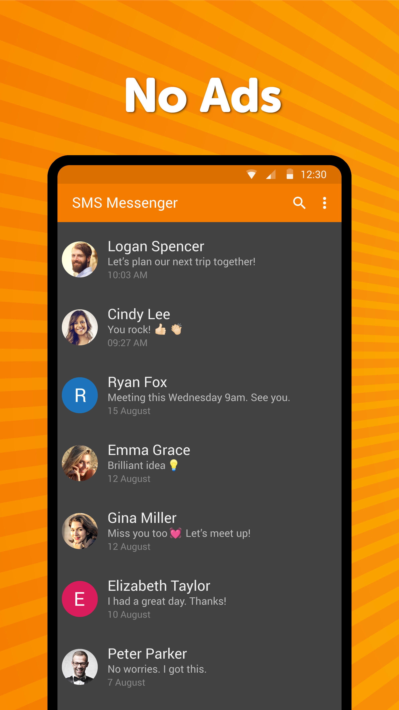
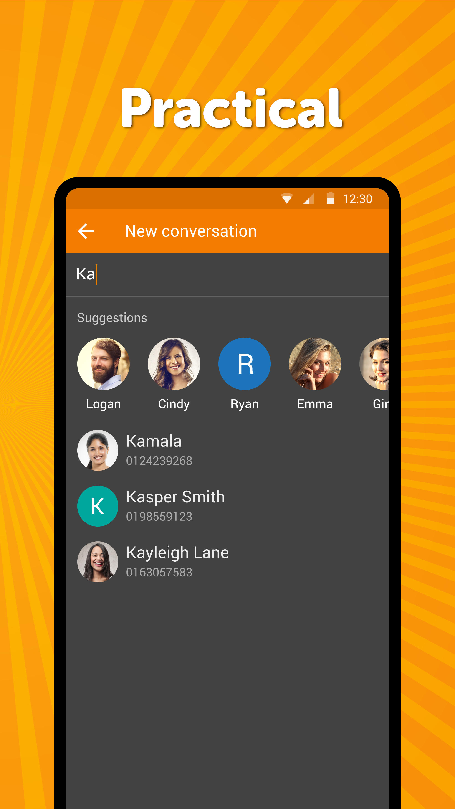

# Simple SMS Messenger

A great way to stay in touch with your relatives, by sending both SMS and MMS messages. The app properly handles group messaging too, just like blocking numbers from Android 7+. Keep in touch with all of your contacts using the messaging app on your phone. It's never been easier to share photos, send emojis, or just say a quick hello. There's so much you can do with your messages, like mute conversations or assign special message tones for certain contacts. With this text message and group messaging app, you can enjoy the daily private messaging and group messaging in a more fun way.

It offers many date formats to choose from, to make you feel comfortable at using it. You can toggle between 12 and 24 hours time format too. This app also gives you the flexibility of sms backup. This way, you don't have to save the messages on any external device or use any other hardware to save it. This sms backup feature will help you efficiently save text message and mms data without being a burden on internal storage.

This messaging app has a really tiny app size compared to the competition, making it really fast to download. The sms backup technique is helpful when you have to change your device or it gets stolen. This way, you can retrieve the text message from both group messaging and private messaging easily using the sms backup in this messaging app.

The blocking feature helps preventing unwanted messages easily, you can block all messages from not stored contacts too. Blocked numbers can be both exported and imported for easy backup. All conversations can be easily exported to a file for simple backup too or migrating between devices.

You can customize which part of the message is visible on the lockscreen too. You can choose if you want only the sender shown, the message, or nothing for enhanced privacy.

It comes with material design and dark theme by default, provides great user experience for easy usage. This messaging app also provides users with the ability to search messages quickly and efficiently. Gone are the days when you have to scroll down through all the private messaging and group messaging conversations to reach your required message. Simply search and get what you want with this text messaging app.

Contains no ads or unnecessary permissions. It is fully opensource, provides customizable colors. You can also customize the font of your text message in both group messaging and private messaging. 

<a href="https://f-droid.org/packages/com.simplemobiletools.smsmessenger">Get it on F-Droid</a>

Support us:  
IBAN: SK4083300000002000965231  
Bitcoin: 19Hc8A7sWGud8sP19VXDC5a5j28UyJfpyJ  
Ethereum: 0xB7a2DD6f2408Bce77334655CF5E7639aE31feb30  
Litecoin: LYACbHTKaM9ZubKQGxJ4NRyVy1gHUuztRP  
Bitcoin Cash: qz6dvmhq5vzkcsypxpp2mnur30muxdah4gvulx3y85  
Tether: 0x250f9cC32863E59b87037a14955Ed64F879653F0  
<a href="https://paypal.me/SimpleMobileTools?country.x=SK&locale.x=en_US">PayPal</a>  
<a href="https://www.patreon.com/tiborkaputa">Patreon</a>

