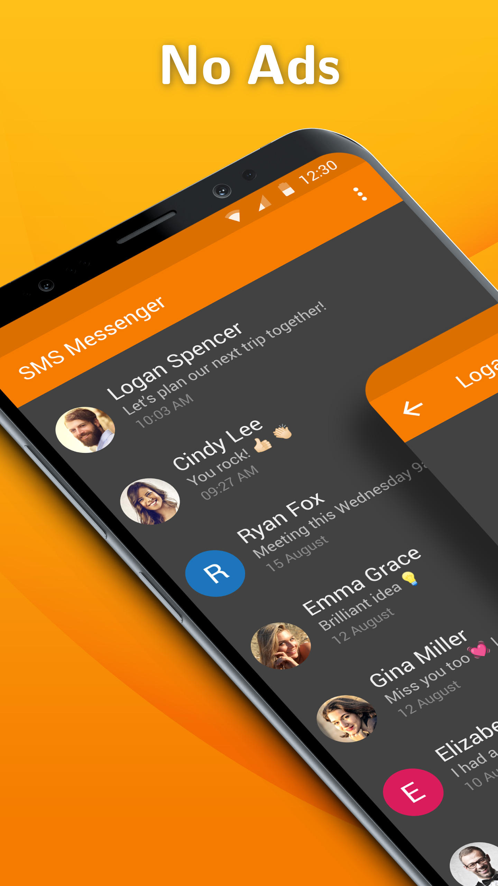
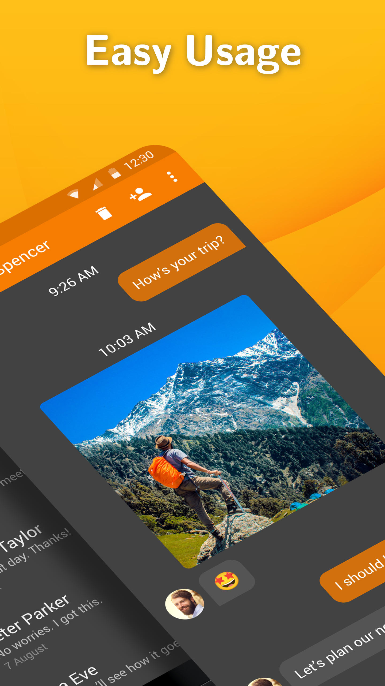
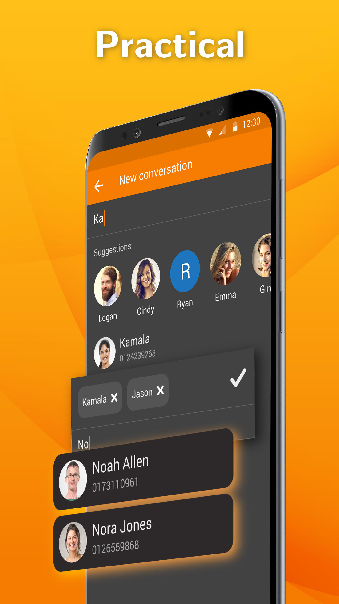

# Simple SMS Messenger

A great way to stay in touch with your relatives, by sending both SMS and MMS messages. The app properly handles group messaging too, just like blocking numbers from Android 7+.

It offers many date formats to choose from, to make you feel comfortable at using it. You can toggle between 12 and 24 hours time format too.

It has a really tiny app size compared to the competition, making it really fast to download.

It comes with material design and dark theme by default, provides great user experience for easy usage. The lack of internet access gives you more privacy, security and stability than other apps.

Contains no ads or unnecessary permissions. It is fully opensource, provides customizable colors.

Check out the full suite of Simple Tools here:
https://www.simplemobiletools.com

Facebook:
https://www.facebook.com/simplemobiletools

Reddit:
https://www.reddit.com/r/SimpleMobileTools

